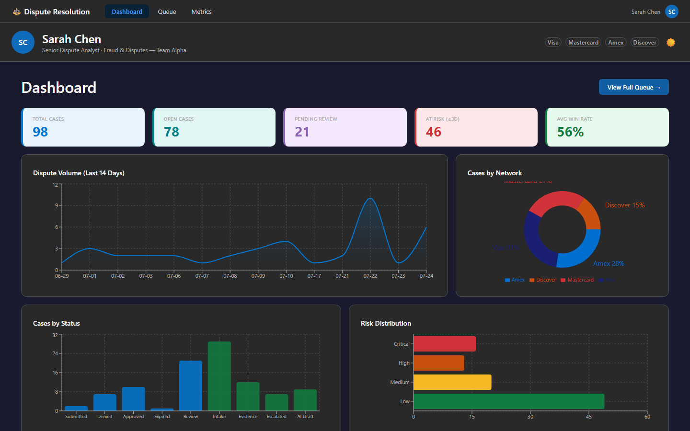
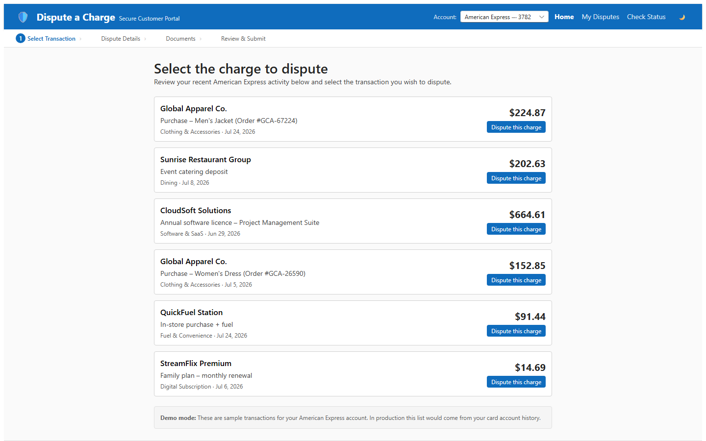

# Payments Dispute Resolution Accelerator

> Payments Dispute Resolution Accelerator | Microsoft Azure

An agentic AI accelerator that automates chargeback evidence assembly — detecting disputes, gathering evidence across source systems, scoring win-probability, drafting grounded AI rebuttals, and routing cases to human analysts for approval before any submission leaves the bank. Built end-to-end on Azure with Durable Functions orchestration and a React analyst UI on Azure Static Web Apps.

<p align="center">
  <a href="#solution-overview">SOLUTION OVERVIEW</a> |
  <a href="#business-scenario">BUSINESS SCENARIO</a> |
  <a href="#quick-deploy">QUICK DEPLOY</a> |
  <a href="#github-actions-cicd">GITHUB ACTIONS CI/CD</a> |
  <a href="#local-development">LOCAL DEVELOPMENT</a> |
  <a href="#supporting-documentation">SUPPORTING DOCUMENTATION</a>
</p>

> ⚠️ **Responsible AI & Security:** This accelerator ships with **synthetic demo data only** — no real cardholder or transaction data is included. Review [`docs/architecture.md`](docs/architecture.md) and your organization's AI governance policies before deploying to production. All AI-drafted rebuttals require human analyst approval before submission.

---

## Solution Overview

The Payments Dispute Resolution Accelerator is an Azure-native agentic solution that compresses the chargeback response cycle from days to minutes. It uses:

- **Azure Durable Functions** orchestration with a human-in-the-loop (HITL) approval gate
- **Azure AI / OpenAI** for evidence summarization and grounded rebuttal drafting (maker-checker pattern)
- **Azure Static Web Apps** serving a React analyst UI (case queue + unified case detail)
- **Azure AI Services** (Document Intelligence, AI Search) for document extraction and retrieval
- **Azure Event Grid** for event-driven dispute intake
- **Synthetic demo data** — 10 realistic dispute cases across Visa, Mastercard, Amex, and Discover; no real cardholder data

📐 **[View the reference architecture →](docs/architecture.md)**

<details open>
<summary><strong>Features</strong></summary>

- **Evidence assembly orchestration** — Durable Functions fan-out retrieves transaction, order, shipping, fraud-signal, and comms evidence in parallel
- **Win-probability scoring** — ML-informed score (0–100 %) displayed per case in the queue and on the detail view
- **Evidence-gap detection** — automatically flags missing required evidence items with impact severity
- **AI-drafted rebuttal with citations** — GPT-generated narrative cites only verified source facts (maker-checker pattern prevents hallucination)
- **Reason-code checklists** — maps each network reason code to its required evidence set; tracks satisfied vs. outstanding items
- **Human-in-the-loop approve / deny / escalate** — analyst decision bar with a 72-hour SLA countdown; no submission without approval
- **Multi-network support** — Visa · Mastercard · American Express · Discover
- **Mock mode** — full UI renders from bundled fixtures with `VITE_USE_MOCK=true`; no backend required for demos

</details>

---

## Business Scenario

A **chargeback** (payment network dispute) arrives at the bank: the cardholder disputes a transaction, the bank has a narrow response window (typically 30–45 days), and assembling the required evidence across 8–15 back-office systems is a manual, error-prone process.

This accelerator replaces that manual workflow. When a dispute event arrives, a Durable Functions orchestrator fans out to gather evidence, an AI agent scores the win-probability and drafts a rebuttal grounded in verified facts, and the case lands in the analyst's queue — pre-packaged and ready for a one-click decision. The [Dispute Resolution Portal](https://<ANALYST_SWA_HOSTNAME>/) and [Customer Portal](https://<PORTAL_SWA_HOSTNAME>/) are live on Azure Static Web Apps.

### Dashboard

The analyst home view shows live KPI tiles (total cases, open, pending review, at-risk, avg win rate), a dispute volume trend chart, cases by card network, cases by status, and risk distribution.

[

*Dashboard: live KPI tiles, dispute volume trend, network and risk distribution charts.*

### Case Queue

The analyst opens a sortable queue showing all active disputes: merchant name, card network, transaction amount, reason code, win-probability score, risk level, status, and a live deadline countdown. An Operations Center panel shows urgent/at-risk summaries and surfaces recent customer activity.

[

*Dispute Case Queue: sortable by any column, color-coded risk badges, Operations Center, customer-activity filter.*

### Case Detail

Selecting a case opens the unified detail view: a header with merchant name and status badge, SLA Progress bar with stage breakdown, Time-to-Score metric, Decision Support section with recovery likelihood and AI recommendation, and full case metadata with collaboration panel.

[

*Case Detail: SLA timeline, AI decision support, evidence center, and analyst approve/deny/escalate.*

### Customer Portal (Dispute Submission Simulation)

The Customer Portal lets cardholders (or demo operators) select a transaction, enter dispute details, upload supporting documents, and submit — driving the full agentic pipeline end-to-end.

[

*Customer Portal: transaction selection → dispute details → document upload → review & submit.*

<details>
<summary><strong>Business value</strong></summary>

| Metric | Manual process | With accelerator |
|--------|---------------|-----------------|
| Evidence assembly time | 2–5 days | Minutes |
| Analyst time per case | 60–120 min | 10–15 min review |
| Evidence completeness | Variable | AI-checked against reason-code rules |
| Rebuttal quality | Writer-dependent | Grounded, citation-backed draft |
| SLA compliance | Missed due to manual bottlenecks | 72-hour countdown + escalation path |
| Network coverage | Case-by-case | Visa · Mastercard · Amex · Discover |

</details>

---

## Quick Deploy

For the fastest path to a running environment in Azure, use `azd up` from the repo root.

### Azure deployment prerequisites

| Tool | Version | Install |
|------|---------|---------|
| [Azure Developer CLI (AZD)](https://learn.microsoft.com/azure/developer/azure-developer-cli/install-azd) | Latest | `winget install microsoft.azd` |
| [Azure CLI](https://learn.microsoft.com/cli/azure/install-azure-cli) | Latest | `winget install microsoft.azure-cli` |
| [Git](https://git-scm.com/) | Latest | `winget install git.git` |

Verify your setup:

```bash
azd version
az version
git --version
```

**Azure subscription:** An active Azure subscription with `Owner` role (needed for Bicep role-assignment resources). See [Guidance → Prerequisites and costs](#prerequisites-and-costs).

**Need the full local toolchain?** See [Local Development](#local-development) for Node.js, Python, Azure Functions Core Tools, local Functions hosting, and Cosmos seeding.

### Deploy with `azd up`

```bash
# 1. Authenticate
azd auth login

# 2. Create an AZD environment (e.g. "dev")
azd env new dev
azd env set AZURE_LOCATION westus2

# 3. Provision infrastructure + deploy both services in one command
azd up
```

`azd up` provisions: Storage Account, Key Vault, Function App (Flex Consumption, Python 3.11), Azure Static Web App (Free SKU), Event Grid System Topic, Azure AI Services, Application Insights, and Log Analytics — all tagged with the AZD environment name.

Or run separately:

```bash
azd provision       # deploy Bicep templates only
azd deploy          # build and deploy both services (api + web)
azd deploy api      # deploy the Functions app only
azd deploy web      # build Vite output and publish React SPA to Static Web Apps only
```

#### Tear down

```bash
azd down        # delete all provisioned Azure resources
```

#### Deployed resource group

After `azd up` completes, all provisioned resources are visible in the Azure Portal under the deployed resource group. Use `azd show` or the Azure CLI to inspect the environment:

```bash
azd show           # list services and their deployed URLs
az group list --tag azd-env-name=dev -o table   # locate the resource group by AZD tag
```

---

## GitHub Actions CI/CD

Two pipelines handle CI/CD:

- [`.github/workflows/ci.yml`](.github/workflows/ci.yml) — builds and tests on every push to any branch
- [`.github/workflows/cd.yml`](.github/workflows/cd.yml) — runs `azd provision` + `azd deploy` on push to `main` after CI passes, using **OIDC federated credentials** (no long-lived secrets)

Configure these **repository secrets/variables** before enabling the CD workflow:

| Name | Description |
|------|-------------|
| `AZURE_CLIENT_ID` | App registration / managed identity client ID |
| `AZURE_TENANT_ID` | Azure AD tenant ID |
| `AZURE_SUBSCRIPTION_ID` | Target Azure subscription ID |

### Configuring OIDC authentication

The CD pipeline authenticates to Azure with **OIDC federated credentials** — no client secrets to store or rotate.

**Recommended — let AZD wire it up:**

```bash
azd pipeline config --provider github
```

When prompted, choose **Federated User Managed Identity**. AZD then creates the identity, sets the federated credential, assigns it a subscription role, and sets the three GitHub secrets.

> **Why a user-assigned managed identity over a service principal?** Managed Azure subscription tenants often restrict Entra **app registration** creation. A user-assigned managed identity is a plain Azure resource governed by subscription RBAC — no directory permissions needed.

**Grant the identity `Owner`.** Bicep provisions role assignments (Function App managed identity storage data roles + deployer blob-upload role), so the CD identity needs `Microsoft.Authorization/roleAssignments/write`. `Owner` (or `Contributor` + `User Access Administrator`) is required; plain `Contributor` will fail.

**Manual alternative** (user-assigned managed identity):

```bash
SUB=<subscription-id>
RG=rg-identity
LOCATION=westus2

az group create -n $RG -l $LOCATION
az identity create -n gh-disputes-cd -g $RG -l $LOCATION
CLIENT_ID=$(az identity show -n gh-disputes-cd -g $RG --query clientId -o tsv)
PRINCIPAL_ID=$(az identity show -n gh-disputes-cd -g $RG --query principalId -o tsv)

az identity federated-credential create \
  --name github-main \
  --identity-name gh-disputes-cd \
  --resource-group $RG \
  --issuer https://token.actions.githubusercontent.com \
  --subject repo:yortch/payment-disputes:ref:refs/heads/main \
  --audiences api://AzureADTokenExchange

az role assignment create --assignee-object-id $PRINCIPAL_ID \
  --assignee-principal-type ServicePrincipal \
  --role Owner --scope /subscriptions/$SUB

gh secret set AZURE_CLIENT_ID -b $CLIENT_ID -R yortch/payment-disputes
gh secret set AZURE_TENANT_ID -b <tenant-id> -R yortch/payment-disputes
gh secret set AZURE_SUBSCRIPTION_ID -b $SUB -R yortch/payment-disputes
```

> **Region must match.** `cd.yml` sets `AZURE_LOCATION: 'westus2'`. Resource names are derived from a location-based token — deploying CD in a different region creates duplicate resources. Keep them aligned.

---

## Local Development

### Local prerequisites

| Tool | Version | Install |
|------|---------|---------|
| [Node.js](https://nodejs.org/) | 20 LTS | `winget install OpenJS.NodeJS.LTS` |
| [Python](https://www.python.org/downloads/) | 3.11 | `winget install python.python.3.11` |
| [Azure Functions Core Tools](https://learn.microsoft.com/azure/azure-functions/functions-run-local) | v4 | `winget install microsoft.azure-functions-core-tools-4` |
| [Git](https://git-scm.com/) | Latest | `winget install git.git` |

Verify your setup:

```bash
python --version      # should be 3.11.x
func --version        # should be 4.x
node --version        # should be 20.x
npm --version         # ships with Node
```

If you plan to connect local code to Azure resources (for example Cosmos seeding with `DefaultAzureCredential`), sign in with the Azure CLI before starting.

### Run the React app locally

```bash
cd src/web
npm install
npm run dev           # Vite dev server → http://localhost:5173
```

The dev server proxies `/api/*` to the Functions app at `http://localhost:7071`.

**No backend running?** Render the UI with bundled mock fixtures — no API needed:

```bash
VITE_USE_MOCK=true npm run dev
```

Or create `src/web/.env.local`:

```
VITE_USE_MOCK=true
```

To build and preview the production bundle:

```bash
npm run build         # type-checks (tsc --noEmit) then bundles → dist/
npm run preview       # serve dist/ locally
```

> See [`src/web/README.md`](src/web/README.md) for the full SPA dev guide.

---

### Local development modes

Three independent modes let you work at any layer of the stack without standing up the full cloud environment.

#### Mode 1 — UI mock-only (no backend required)

Renders the full case queue and case-detail view from bundled fixture data.  No Functions host, no Cosmos account needed.

```bash
cd src/web
npm install
VITE_USE_MOCK=true npm run dev
# → http://localhost:5173
```

Or persist the setting in `src/web/.env.local` (git-ignored):

```
VITE_USE_MOCK=true
```

#### Mode 2 — API with synthetic store (no Cosmos required)

Serves all ten case fixtures from `src/data/synthetic/` files.  No Cosmos account, no network calls — the default when `CASE_STORE` is unset.

```bash
# Terminal 1 — start the Functions host
cd src/api
func start
# Health check: http://localhost:7071/api/health
# Cases:        http://localhost:7071/api/cases
```

`src/api/local.settings.json` (already committed; copy from `local.settings.json.sample` if missing) should contain:

```json
{
  "IsEncrypted": false,
  "Values": {
    "FUNCTIONS_WORKER_RUNTIME": "python",
    "AzureWebJobsStorage": "UseDevelopmentStorage=true",
    "CASE_STORE": "synthetic"
  },
  "Host": { "CORS": "*" }
}
```

`CASE_STORE=synthetic` (or unset) **never** imports `azure.cosmos` or calls `DefaultAzureCredential`.  Leave `COSMOS_ENDPOINT` blank — it is not read in synthetic mode.

> **Tip:** Use [Azurite](https://learn.microsoft.com/azure/storage/common/storage-use-azurite) (`npx azurite`) as the local storage emulator for `AzureWebJobsStorage=UseDevelopmentStorage=true`.

#### Mode 3 — Full local stack (UI + API synthetic, no cloud)

Runs the React dev server proxying `/api/*` calls to the local Functions host.

```bash
# Terminal 1 — Functions host (synthetic store)
cd src/api
func start

# Terminal 2 — Vite dev server (proxies /api → localhost:7071)
cd src/web
npm install
npm run dev
# → http://localhost:5173   (UI reads cases from your local Functions host)
```

The `vite.config.ts` proxy rule (`/api → http://localhost:7071`) is already configured — no extra setup required.

> To switch to live Cosmos data, set `CASE_STORE=cosmos` and `COSMOS_ENDPOINT=https://<account>.documents.azure.com:443/` in `local.settings.json`, then restart `func start`.

---

### Local Functions development

#### Clone and enter the repo

```bash
git clone https://github.com/yortch/payment-disputes.git
cd payment-disputes
```

#### Create and activate a Python virtual environment

```bash
# Windows
python -m venv .venv
.venv\Scripts\activate

# macOS / Linux
python -m venv .venv
source .venv/bin/activate
```

#### Install dependencies

```bash
pip install -r src/api/requirements.txt
pip install pytest pytest-asyncio flake8   # dev/test tools
```

#### Configure local settings for the Functions app

`src/api/local.settings.json` is committed with safe synthetic-mode defaults.
Copy `src/api/local.settings.json.sample` to `local.settings.json` if you need a fresh copy, then edit as needed:

```json
{
  "IsEncrypted": false,
  "Values": {
    "FUNCTIONS_WORKER_RUNTIME": "python",
    "AzureWebJobsStorage": "UseDevelopmentStorage=true",
    "CASE_STORE": "synthetic",
    "COSMOS_ENDPOINT": "",
    "COSMOS_DATABASE_NAME": "disputes-db"
  },
  "Host": { "CORS": "*" }
}
```

`CASE_STORE` options:

| Value | Backend | Requires |
|-------|---------|----------|
| `synthetic` (default) | `src/data/synthetic/` JSON fixtures | Nothing — works offline |
| `cosmos` | Azure Cosmos DB `disputes` container | `COSMOS_ENDPOINT` + RBAC role |

#### Run the Functions app locally

```bash
cd src/api
func start
```

Health endpoint: `http://localhost:7071/api/health`

#### Run tests

```bash
cd src/api
python -m pytest -q
```

---

### Seeding Cosmos DB

After provisioning, the `disputes` Cosmos container is populated with the 10 synthetic cases
automatically by the `deploy-api` job in `.github/workflows/cd.yml` (runs on the self-hosted,
in-VNet runner so it can reach the now-private Cosmos account) — no manual step required in CD.
For local `azd up`, run the seed script manually afterward (see below); there is no `postdeploy`
hook in `azure.yaml` anymore, since a top-level hook fired after every service deploy (including
`web`/`portal` on the GitHub-hosted runner, which lacks both network access and the Python deps).

The seed is **idempotent**: re-running it upserts the same document ids with no duplicates.
It uses **DefaultAzureCredential (RBAC-only)** — no connection strings or keys.

#### Manual re-seed

```bash
# bash / macOS / Linux
cd src/api
COSMOS_ENDPOINT=https://<account>.documents.azure.com:443/ python scripts/seed_cosmos.py

# PowerShell / Windows
cd src\api
$env:COSMOS_ENDPOINT = "https://<account>.documents.azure.com:443/"
python scripts\seed_cosmos.py
```

Replace `<account>` with your Cosmos account name (output from `azd env get-values`
as `AZURE_COSMOS_ENDPOINT`).

> **Soft-fail:** If `COSMOS_ENDPOINT` / `AZURE_COSMOS_ENDPOINT` is unset the script
> logs *"Cosmos endpoint not configured — skipping seed"* and exits 0.
> This prevents deploy failures in local environments where Cosmos is not yet provisioned.

---

## Guidance

### Prerequisites and costs

| Requirement | Notes |
|-------------|-------|
| Azure subscription | Active subscription with `Owner` role |
| [Azure Developer CLI](https://learn.microsoft.com/azure/developer/azure-developer-cli/install-azd) | `winget install microsoft.azd` |
| [Azure CLI](https://learn.microsoft.com/cli/azure/install-azure-cli) | Used by AZD under the hood |
| Python 3.11 | Required for the Azure Functions runtime |
| Node.js 20 LTS | Required to build the React SPA |

**Cost estimate (demo):** Azure Consumption Functions and the Azure Static Web Apps Free tier incur minimal cost at demo scale. Azure AI Services and Application Insights are the primary cost drivers. Use `azd down` to remove all resources when not in use.

### Resources

| Product | Description | Cost tier |
|---------|-------------|-----------|
| [Azure Functions (Flex Consumption)](https://azure.microsoft.com/products/functions) | Serverless orchestration + API; Python 3.11 | Pay-per-use |
| [Azure Static Web Apps](https://azure.microsoft.com/products/app-service/static) | React SPA hosting + linked backend routing | Free tier |
| [Azure OpenAI / AI Services](https://azure.microsoft.com/products/ai-services/openai-service) | Rebuttal drafting, document extraction, AI Search | Per token / per call |
| [Azure Storage](https://azure.microsoft.com/products/storage) | Functions host storage; synthetic case fixtures | LRS, low volume |
| [Application Insights](https://azure.microsoft.com/products/monitor) | Telemetry + live metrics | Per GB ingested |

---

## Project Structure

```
payment-disputes/
├── azure.yaml                  # AZD manifest — api (Functions) + web (SWA) services
├── infra/
│   ├── main.bicep              # Subscription-scoped entry point
│   ├── main.parameters.json    # AZD → Bicep parameter bindings
│   ├── abbreviations.json      # Azure resource name prefixes
│   └── modules/
│       ├── monitoring.bicep    # Log Analytics + Application Insights
│       ├── storage.bicep       # Storage Account
│       ├── keyvault.bicep      # Key Vault (RBAC authorization)
│       ├── functions.bicep     # Flex Consumption plan + Function App (identity-based storage)
│       ├── staticwebapp.bicep  # Azure Static Web App (Free SKU, tagged azd-service-name: web)
│       ├── eventgrid.bicep     # Event Grid System Topic
│       └── ai.bicep            # Azure AI Services
├── src/
│   ├── shared/
│   │   ├── schemas/
│   │   │   └── case.schema.json        # Authoritative dispute-case JSON Schema (contract)
│   │   └── README.md                   # Documents the three-representation contract
│   ├── api/                            # Azure Functions app (Python 3.11)
│   │   ├── function_app.py             # Function app entry + health endpoint
│   │   ├── host.json                   # Functions host config
│   │   ├── requirements.txt            # Python dependencies
│   │   ├── orchestrator/
│   │   │   └── dispute_orchestrator.py # Durable orchestrator + analyst-approval gate
│   │   ├── activities/
│   │   │   └── case_activities.py      # assemble_case, submit_to_network, notify_supervisor activities
│   │   ├── services/
│   │   │   └── case_store.py           # Loads synthetic fixtures, derives CaseSummary, live daysRemaining
│   │   ├── triggers/
│   │   │   ├── case_read.py            # GET /cases, GET /cases/{id}
│   │   │   └── case_actions.py         # POST approve / deny / escalate
│   │   └── models/
│   │       └── case.py                 # Python dataclasses — mirrors case.schema.json, keep in sync
│   ├── web/                            # React SPA (Azure Static Web Apps)
│   │   ├── package.json                # React 18 · Vite 5 · Fluent UI v9 · react-router-dom v6
│   │   ├── vite.config.ts              # Dev proxy /api → localhost:7071; outDir dist/
│   │   ├── tsconfig.json               # TypeScript strict config
│   │   ├── index.html                  # SPA entry point
│   │   ├── staticwebapp.config.json    # SPA fallback routing (/api/* excluded)
│   │   ├── README.md                   # SPA dev guide (npm install / run dev / build)
│   │   └── src/
│   │       ├── main.tsx                # React root mount
│   │       ├── App.tsx                 # FluentProvider + BrowserRouter + routes
│   │       ├── api/
│   │       │   └── cases.ts            # Typed fetch client (mock-mode + live-fallback)
│   │       ├── components/             # Fluent UI components: badges, table, panels, action bar
│   │       ├── pages/
│   │       │   ├── QueuePage.tsx       # Route / — case queue list
│   │       │   └── CaseDetailPage.tsx  # Route /cases/:id — unified evidence + action view
│   │       ├── types/
│   │       │   └── case.ts             # TS interfaces — mirrors case.schema.json, keep in sync
│   │       └── mocks/
│   │           └── cases.ts            # Demo fixtures (CaseSummary[] + Case map)
│   └── data/
│       └── synthetic/
│           ├── generate_cases.py       # Synthetic dispute-case generator (stdlib, schema-validated)
│           ├── cases.json              # Combined array of the 10 demo cases
│           ├── cases/                  # One JSON file per case (served by the read API)
│           └── README.md
├── docs/
│   ├── architecture.md                 # Reference architecture + Mermaid diagram
│   └── images/readme/                  # README screenshots
├── .github/workflows/
│   ├── ci.yml                          # Build & test on every branch push
│   └── cd.yml                          # AZD provision + deploy on main (after CI)
├── prd.md                              # Product Requirements Document
└── CHANGELOG.md                        # Change history
```

---

## Supporting Documentation

| Document | Description |
|----------|-------------|
| [`prd.md`](prd.md) | Product Requirements Document — vision, personas, success metrics, roadmap |
| [`docs/architecture.md`](docs/architecture.md) | Reference architecture — 6-layer diagram + maker-checker agent flow |
| [`CHANGELOG.md`](CHANGELOG.md) | Change history |
| [`src/web/README.md`](src/web/README.md) | React SPA dev guide — routes, API client, component structure |
| [`src/shared/README.md`](src/shared/README.md) | Shared contract — JSON Schema, Python dataclasses, TypeScript interfaces |
| [`src/data/synthetic/README.md`](src/data/synthetic/README.md) | Synthetic data generation and fixture details |

---

[](https://github.com/yortch/payment-disputes/actions/workflows/ci.yml)
[](https://github.com/yortch/payment-disputes/actions/workflows/cd.yml)

---

> **Responsible AI:** This accelerator is intended as a decision-support tool. All AI-generated content (win-probability scores, evidence summaries, rebuttal drafts) must be reviewed and approved by a qualified human analyst before any submission to a payment network. Do not deploy with real cardholder data without completing a full Responsible AI review and compliance assessment for your organization.
