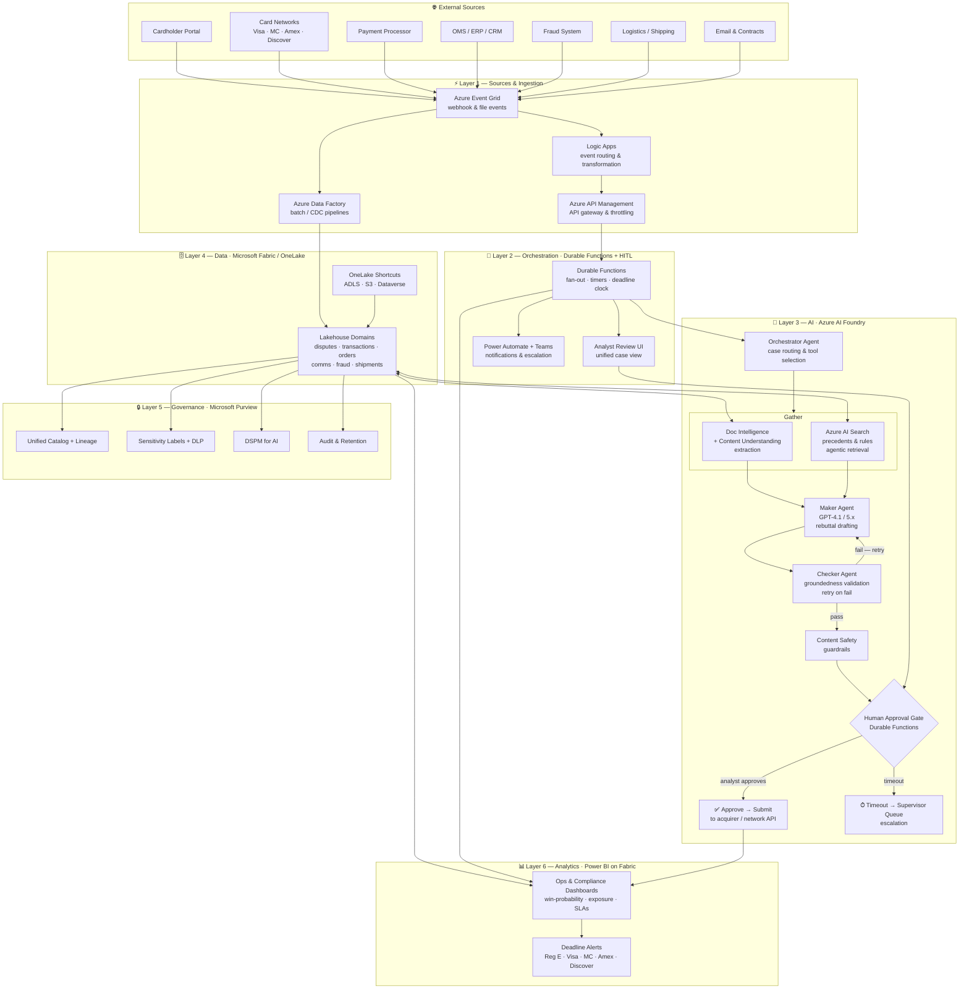
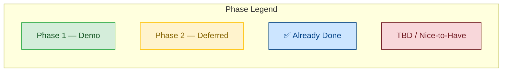
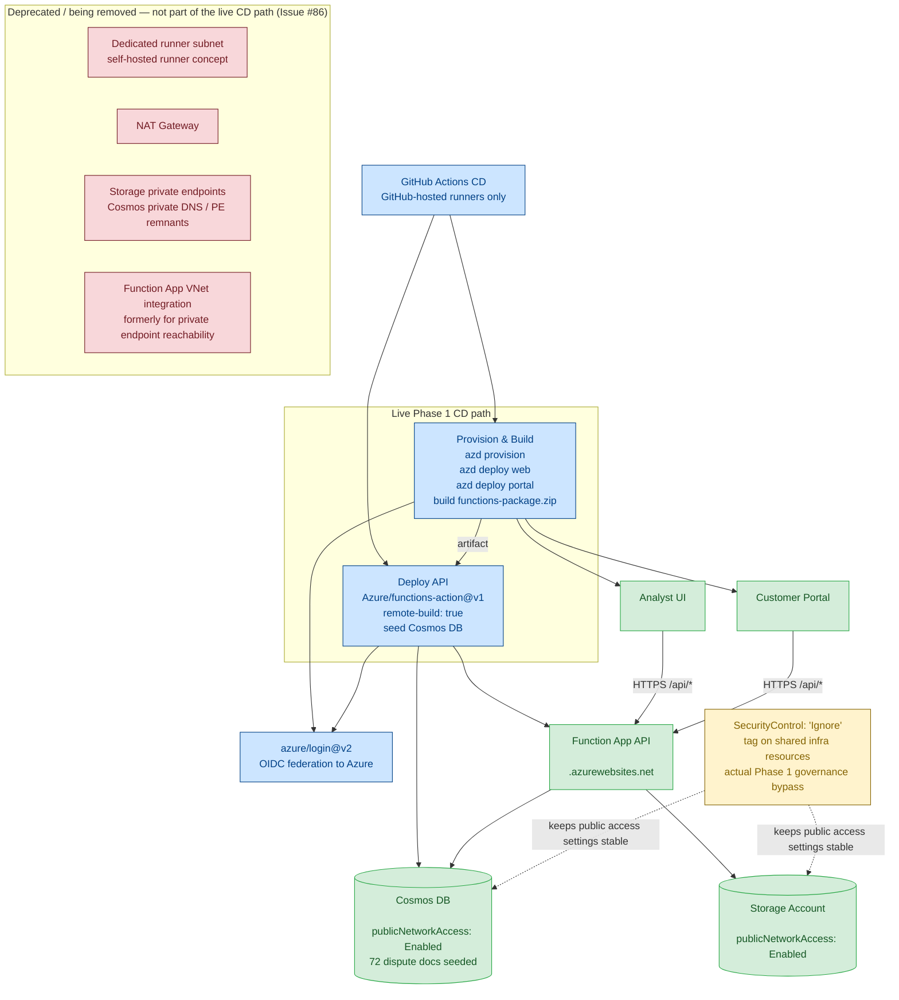

# Reference Architecture — Payments Dispute Resolution

> Payments Dispute Resolution | June 2026
> Related: [Product Requirements Document](../prd.md) · [Dispute Ingestion & Component Flow](./ingestion-flow.md) · [GitHub Issue #5](https://github.com/yortch/payment-disputes/issues/5)

---

## Overview

The Payments Dispute Resolution accelerator is built end-to-end on Azure and Microsoft Fabric. It assembles chargeback evidence in minutes, scores win-probability, drafts a grounded rebuttal, and packages a network-compliant submission — always with a human in the loop before anything leaves the bank.

The architecture is organized into **6 layers**, flowing top-to-bottom from external event sources through ingestion, orchestration, AI, data, governance, and analytics.

---

## Architecture Diagram

---

## Phase Overlay — Demo Scope vs. Deferred

> Updated: 2026-07-08. See also [PRD §13a — Delivery Phases](../prd.md#13a-delivery-phases-demo-scope).

The architecture layers are divided into **Phase 1 (demo / feasibility proof point, ~July 2026)** and **Phase 2 (production-ready accelerator, post-demo)**. Some layers have a sliced Phase 1 sub-set with the remaining scope deferred.

### Layer-by-Layer Phase Mapping

| Layer | Component | Phase | Notes |
|-------|-----------|-------|-------|
| **Sources & Ingestion** | Azure Event Grid (webhook intake) | **Phase 1** | Pairs with #15 event-driven intake and #3 Cosmos ingestion. |
| **Sources & Ingestion** | Logic Apps + APIM (full event routing) | Phase 2 | #7 — full production event topology deferred. |
| **Sources & Ingestion** | Azure Data Factory (batch/CDC) | Phase 2 | #4 — batch pipelines deferred. |
| **Orchestration** | Durable Functions (engine) | ✅ Done | #8 complete. |
| **Orchestration** | HITL Approval Gate | **Phase 1** | #22 — Durable Functions gate. |
| **Orchestration** | Power Automate + Teams notifications | Phase 2 | #23 — may become email-based. |
| **Orchestration** | Escalation / Supervisor Queue | Phase 2 | #24. |
| **AI — Orchestrator** | Orchestrator Agent (full case routing) | Phase 2 | #10. |
| **AI — Gather** | Doc Intelligence + Content Understanding | Phase 2 | #11. |
| **AI — Gather** | Azure AI Search (precedents & rules) | **Phase 1** | #12 — evidence retrieval agent. |
| **AI — Maker** | GPT rebuttal drafting (Maker Agent) | **Phase 1** | #13 — absorbs #20. |
| **AI — Checker** | Checker Agent (groundedness validation) | Phase 2 | #14 — deferred; #18 covers lightweight completeness only. |
| **AI — Completeness** | Completeness & gaps (lightweight slice) | **Phase 1** | #18 — completeness-only; full Checker deferred. |
| **AI — Reason Codes** | Reason-code-aware engine | **Phase 1** | #16. |
| **AI — Scoring** | Win-probability scoring & risk assessment | **Phase 1** | #30. |
| **AI — Safety** | Content Safety guardrails | Phase 2 | Part of full Checker flow. |
| **Data** | Cosmos DB (dispute ingestion) | **Phase 1** | #3 slice + #15 + #54 (done). |
| **Data** | Microsoft Fabric workspace (Power BI) | **Phase 1** | #1 slice — reporting only. |
| **Data** | OneLake Lakehouse (full 6 domains) | Phase 2 | #1 parent + #3 OneLake load. |
| **Data** | OneLake Shortcuts (ADLS/S3/Dataverse) | Phase 2 | Part of full lakehouse. |
| **Governance** | Microsoft Purview (catalog, DLP, DSPM) | Phase 2 | #9. |
| **Analytics** | Power BI dashboards (analyst-facing) | **Phase 1** | Fabric workspace slice (#1). |
| **Analytics** | Ops dashboard (VP persona) | Phase 2 | #29. |
| **Compliance** | Network-compliant packaging | Phase 2 | #25. |
| **Compliance** | Network submission APIs | Phase 2 | #26. |
| **Customer / Simulation** | Dispute intake simulation tool | **Phase 1** | #31 — not a real portal; demo submission tool only. |
| **Customer / Simulation** | Document/receipt upload | **Phase 1** | #32 — mock MVP with pre-loaded docs. |
| **Evidence Retrieval** | Mock retrieval (1 card network) | **Phase 1** | #17 slice. |
| **Evidence Retrieval** | Full multi-system retrieval (8–15 systems) | Phase 2 | #17 parent. |
| **Regulations** | Reg E documentation | **Phase 1** | #27. |
| **Regulations** | Reg Z + card-network rules | **Phase 1** | #28. |
| **SLA / Deadlines** | Deadline & SLA management (timers) | TBD | #19 — nice-to-have, not committed. |

---

### Layer 1 — Sources & Ingestion
External events (dispute webhooks from card networks, batch files from processors, customer uploads from the portal) flow into **Azure Event Grid** for real-time routing, through **Logic Apps** for lightweight transformation and fan-out, secured by **Azure API Management** as the gateway layer. **Azure Data Factory** handles bulk and CDC pipelines for back-office systems (OMS, ERP, CRM, fraud, logistics).

### Layer 2 — Orchestration
**Azure Durable Functions** provide the stateful, long-running orchestration backbone: fan-out evidence gathering, countdown timers that enforce card-network deadlines (Reg E, Visa ~30 days, Mastercard 20–45 days), and the human-in-the-loop (HITL) approval gate. The **Analyst Review UI** surfaces a unified case view, and **Power Automate + Microsoft Teams** handle analyst notifications and escalation paths.

### Layer 3 — AI (Azure AI Foundry)
An **Orchestrator Agent** routes each case to the correct tool pipeline. The **Gather** step uses **Azure AI Document Intelligence** (and Content Understanding) for structured extraction from receipts, PDFs, and emails, and **Azure AI Search** for agentic retrieval of precedents and reason-code rules. The **Maker Agent** (GPT-4.1/5.x) drafts the rebuttal narrative; the **Checker Agent** validates groundedness and retries on failure. **Content Safety** guardrails screen the output before it reaches the **Human Approval Gate** (Durable Functions), where an analyst approves submission or the case escalates to the supervisor queue on timeout.

### Layer 4 — Data (Microsoft Fabric / OneLake)
A **OneLake Lakehouse** holds six dispute-evidence domains: disputes, transactions, orders, communications, fraud signals, and shipment records. **OneLake Shortcuts** federate external data stores (ADLS Gen2, Amazon S3, Dataverse) without copying data, enabling a single logical data estate across the enterprise.

### Layer 5 — Governance (Microsoft Purview)
**Microsoft Purview** enforces a unified catalog with end-to-end lineage across all lakehouse domains. **Sensitivity labels and DLP** policies prevent unauthorized data movement, **DSPM for AI** monitors AI-processed data for compliance, and comprehensive **audit and retention** policies satisfy Reg E/Z and card-network recordkeeping requirements.

### Layer 6 — Analytics (Power BI on Fabric)
**Power BI** dashboards — embedded directly within the Fabric workspace — surface real-time ops metrics (win-probability, case backlog, exposure), compliance KPIs, and **deadline countdown alerts** for every open case. Both the Dispute Analyst and VP Operations personas consume these dashboards as their primary visibility layer.

---

## Maker-Checker Pattern — Human Approval Gate

The agentic pipeline follows a strict maker-checker pattern before any evidence package leaves the bank:

| Step | Actor / Service | Detail |
|------|----------------|--------|
| 1 — Dispute event | Webhook | Starts the Durable Functions workflow and sets the deadline clock. |
| 2 — Route | Orchestrator Agent | Inspects reason code and routes to the appropriate tool set. |
| 3 — Gather | Doc Intelligence + AI Search | Extracts structured evidence; retrieves precedents and applicable card-network rules. |
| 4 — Maker | GPT-4.1 / 5.x | Drafts a grounded rebuttal narrative citing only verified facts from the evidence set. |
| 5 — Checker | Checker Agent | Validates groundedness; retries the Maker on failure (max retries configurable). |
| 6 — Safety | Content Safety | Final content guardrail before human review. |
| 7 — Human Gate | Analyst (Durable Functions) | Analyst reviews in the Review UI and approves or rejects. |
| 8a — Approve | Network API | Evidence pack submitted to the acquirer / card network. |
| 8b — Timeout | Supervisor Queue | Case escalated if analyst does not respond within the SLA window. |

> ⚠️ **No evidence package leaves the bank without explicit analyst sign-off.**

---

## Technology Stack Reference

| Layer | Service | Role |
|-------|---------|------|
| Ingestion | Azure Event Grid | Real-time event routing from all source systems |
| Ingestion | Azure Logic Apps | Event transformation, connector fan-out |
| Ingestion | Azure API Management (APIM) | API gateway, throttling, security |
| Ingestion | Azure Data Factory | Batch & CDC pipelines |
| Orchestration | Azure Durable Functions | Stateful workflow, timers, HITL gate |
| Orchestration | Power Automate + Teams | Analyst notifications, escalation |
| AI | Azure AI Foundry | Agent hosting and orchestration |
| AI | Azure AI Document Intelligence | Receipt/PDF/email extraction |
| AI | Azure AI Search | Agentic retrieval — precedents & rules |
| AI | GPT-4.1 / GPT-5.x | Rebuttal drafting (Maker) |
| AI | Azure Content Safety | Output guardrails |
| Data | Microsoft Fabric / OneLake | Lakehouse — six evidence domains |
| Data | OneLake Shortcuts | ADLS · S3 · Dataverse federation |
| Governance | Microsoft Purview | Catalog, lineage, DLP, DSPM for AI, audit |
| Analytics | Power BI on Fabric | Ops dashboards, deadline alerts |

---

## Phase 1 — Final Deployment & Networking Architecture

> Corrected: 2026-07-09. This section covers the live deployment/CD topology for the Phase 1 demo environment, not the application layers above.

### What is actually live

The private-networking / self-hosted-runner design documented earlier is **not** the final Phase 1 architecture. The confirmed-working path today is simpler:

- **All CI/CD jobs run on GitHub-hosted runners** over the public internet.
- **Storage** (`<STORAGE_ACCOUNT_NAME>`) and **Cosmos DB** (`<COSMOS_ACCOUNT_NAME>`) both run with `publicNetworkAccess: Enabled`.
- The Phase 1 compliance mechanism is the shared **`SecurityControl: 'Ignore'` tag** applied in `infra/main.bicep`, which keeps the organizational governance modify-policy set from re-locking those resources back to private/restricted defaults.
- The Functions deploy step uses **`Azure/functions-action@v1` with `remote-build: true`**, which matches Flex Consumption's deployment model. The earlier `az functionapp deploy --type zip` path is not the live solution.

This is the architecture that is currently green end-to-end in CD: provision/build, both Static Web Apps, Functions deploy, and Cosmos seed. The live Cosmos container (`disputes-db/disputes`) is seeded with **72 dispute documents**.

### Diagram

**Live Phase 1 path, at a glance:**

| Resource / path | Current reality |
|-----------------|-----------------|
| GitHub Actions CD | **GitHub-hosted runners only**. No self-hosted runner is required for provision, deploy, or seed. |
| Azure auth from CD | `azure/login@v2` via OIDC; no long-lived Azure credential is embedded in the workflow. |
| Function App deploy | `Azure/functions-action@v1` with `remote-build: true`, which works with Flex Consumption's blob-container deployment model. |
| Storage Account (`<STORAGE_ACCOUNT_NAME>`) | **Publicly reachable over TLS** with `publicNetworkAccess: Enabled`; still protected by Azure auth/RBAC. |
| Cosmos DB (`<COSMOS_ACCOUNT_NAME>`) | **Publicly reachable over TLS** with `publicNetworkAccess: Enabled`; seeded today with 72 records in `disputes-db/disputes`. |
| Governance / compliance behavior | `SecurityControl: 'Ignore'` on shared tags is the **actual** Phase 1 mechanism that keeps organizational modify policies from forcing these resources back to restricted/private settings. |
| VNet / private endpoint artifacts | Still present in Bicep in places, but **not load-bearing for the live demo path**. Cleanup is tracked in [Issue #86](https://github.com/yortch/payment-disputes/issues/86). |

### Confirmed Phase 1 endpoints

| Component | Resource name | Live endpoint |
|-----------|---------------|---------------|
| Analyst UI | `<ANALYST_SWA_NAME>` | `https://<ANALYST_SWA_HOSTNAME>` |
| Customer portal | `<PORTAL_SWA_NAME>` | `https://<PORTAL_SWA_HOSTNAME>` |
| API | `<FUNCTION_APP_NAME>` | `https://<FUNCTION_APP_NAME>.azurewebsites.net` |
| Cosmos DB | `<COSMOS_ACCOUNT_NAME>` | `https://<COSMOS_ACCOUNT_NAME>.documents.azure.com:443/` |

### Why the earlier diagram was wrong

The previously documented design assumed that tenant policy made private networking mandatory and therefore forced CD onto a self-hosted runner inside a VNet. That is no longer the architecture to describe here. For the Phase 1 demo environment, the stable and confirmed-working approach is the tag-based policy bypass plus public access on Storage/Cosmos, with all deployment steps staying on GitHub-hosted runners.

### Orphaned infrastructure to treat as tech debt

Some private-networking resources still exist in Bicep because cleanup has not happened yet. They should be understood as **orphaned or being retired**, not as active security controls required for Phase 1:

- NAT Gateway and dedicated `runner` subnet for the never-adopted self-hosted runner path
- Storage private endpoints for blob / queue / table
- Cosmos private DNS zone remnants after the Cosmos private endpoint was removed
- Function App VNet integration that was only needed for the private-endpoint design

Do **not** read those artifacts as the source of current security posture. Their removal is tracked separately in [Issue #86](https://github.com/yortch/payment-disputes/issues/86).

---

## References

- [Product Requirements Document](../prd.md) — full context including personas, success metrics, and compliance requirements.
- [GitHub Issue #5 — Document and finalize reference architecture diagram](https://github.com/yortch/payment-disputes/issues/5)
- [Project Board](https://github.com/users/yortch/projects/5)
