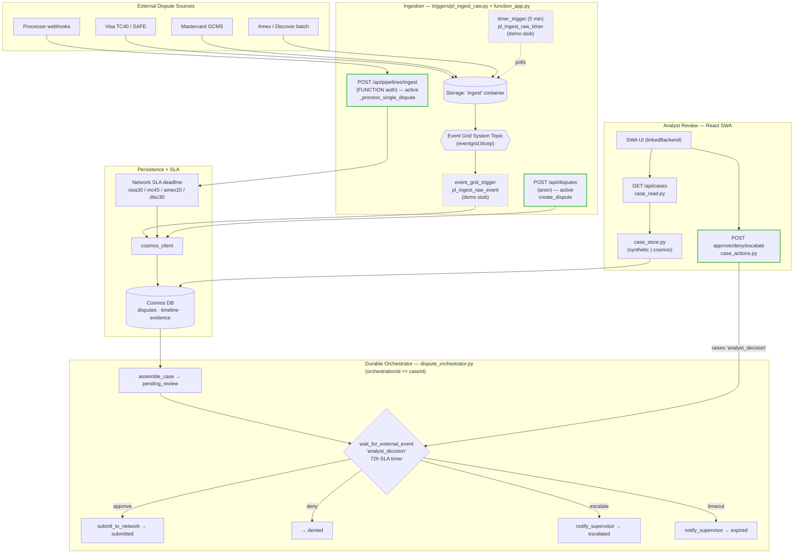

# Dispute Ingestion & Component Flow

> Payments Dispute Resolution
> Related: [Reference Architecture](./architecture.md) · [Cosmos DB Integration](./cosmos-db-integration.md)

This document shows how new disputes enter the system and flow through persistence,
the durable orchestration (human-in-the-loop) loop, and the analyst review UI. It reflects
the **current state of the code** in `src/api/`, distinguishing paths that are fully
implemented from those that are designed but demo-stubbed.

---

## Phase 1 / Phase 2 Scope Reconciliation

> Added: 2026-07-08. See [PRD §13a — Delivery Phases](../prd.md#13a-delivery-phases-demo-scope) and [Architecture Phase Overlay](./architecture.md#phase-overlay--demo-scope-vs-deferred).

| Ingestion path | Phase 1 scope | Phase 2 scope |
|----------------|--------------|---------------|
| **Cosmos DB — dispute ingestion** (#3 slice + #15 + #54) | ✅ **In scope** — the primary demo ingestion path. Disputes are created via `POST /api/disputes` (anonymous) and `POST /api/pipelines/ingest` (FUNCTION auth), written to Cosmos, and picked up by the Durable orchestrator. | OneLake load (#3 parent) deferred. |
| **Event Grid blob trigger** (Visa TC40/SAFE, MC GCMS, Amex/Discover batches) | Demo stub only — trigger fires but does not yet download/parse blob content. End-to-end blob path not wired for Phase 1. | Full production path via Event Grid + Logic Apps + APIM (#7) is Phase 2. |
| **Timer-based poll** | Demo stub — logs only. | — |
| **OneLake / Data Factory** | ❌ Not in scope for demo. | Full batch/CDC pipelines (#4) and OneLake lakehouse load (#3 parent) are Phase 2. |
| **Evidence data (mock)** | TBD — MVP mock evidence data is a nice-to-have (#3 facet, not committed). | Full evidence retrieval from 8–15 source systems (#17 parent) is Phase 2. |

**Key Phase 1 constraint:** The demo proves the Cosmos-based ingestion → Durable Functions → HITL loop. The OneLake lakehouse and all real-time network-file paths are deferred. The two active entry points (#3 and #4 in the table above, i.e. `POST /api/pipelines/ingest` and `POST /api/disputes`) carry the entire demo load.

---

**Legend**
- **Solid green** — fully implemented today (`/api/pipelines/ingest`, `/api/disputes`, analyst approve/deny/escalate).
- **Dashed amber** — designed but demo-stubbed (Event Grid blob trigger and timer poll log only; they do not yet download/parse blob content).

---

## Ingestion Entry Points

| # | Path | Trigger | Auth | State | Handler |
|---|------|---------|------|-------|---------|
| 1 | Blob drop → Event Grid | `@event_grid_trigger` on `BlobCreated` in `ingest` container | System Topic | **Demo stub** | `pl_ingest_raw_event` |
| 2 | Timer poll | `@timer_trigger` every 5 min (`0 */5 * * * *`) | — | **Demo stub** | `pl_ingest_raw_timer` |
| 3 | Pipeline webhook / batch | `POST /api/pipelines/ingest` | FUNCTION | **Active** | `ingest_raw_http` → `_process_single_dispute` |
| 4 | Single-case intake | `POST /api/disputes` | Anonymous | **Active** | `create_dispute` |

All paths write to **Cosmos DB** via `cosmos_client` and record a `status='intake'` timeline event.
The pipeline path (#3) also computes a **network-specific SLA deadline** when one is not supplied:

| Network | SLA window (days from transaction date) |
|---------|------------------------------------------|
| Visa | 30 |
| Mastercard | 45 |
| Amex | 20 |
| Discover | 30 |

The intended production ingestion path is #1 (real-time blob-drop of network files —
Visa TC40/SAFE, Mastercard GCMS, Amex/Discover batches). Path #3 is the webhook/manual
entry used by payment processors and batch imports.

---

## Downstream Processing

Once a dispute exists in Cosmos, the **Durable Functions orchestrator**
(`dispute_orchestrator.py`, instance id `== caseId`) drives the human-in-the-loop loop:

1. `assemble_case` activity loads the case and sets `status = pending_review`.
2. `wait_for_external_event("analyst_decision")` races against a **72h SLA timer**.
3. Branch on the analyst decision:
   - **approve** → `submit_to_network` activity → `submitted`
   - **deny** → `denied`
   - **escalate** → `notify_supervisor` activity → `escalated`
   - **SLA timeout** → `notify_supervisor` activity → `expired`

The analyst UI (React Static Web App) reads the queue via `GET /api/cases` (`case_read.py`)
and raises the `analyst_decision` external event through the approve/deny/escalate routes in
`case_actions.py`.

---

## Known Gaps / Follow-ups

- **Event Grid subscription not wired.** `eventgrid.bicep` provisions the Storage **System Topic**
  but no event subscription binds `BlobCreated` to `pl_ingest_raw_event`, and the handler does not
  yet download/parse the blob. Path #1 is not end-to-end.
- **Timer path is a placeholder.** `pl_ingest_raw_timer` logs a check but does not enumerate or
  process files in the `ingest` container.
- **Two data models coexist.** Ingestion writes *dispute* documents via `cosmos_client` /
  `cosmos_models`, while the analyst queue reads *case* documents via `case_store.py`
  (`case_read.py`). Both target Cosmos, but the read and write shapes should be reconciled so that
  freshly ingested disputes surface in the analyst review queue.
